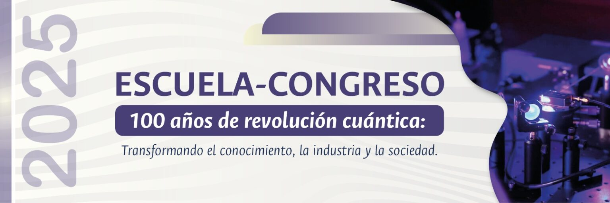

# Academic notes and research works by Miguel Jaramillo
The ideaof this blog is to condence my experience in my time at he academy my time doing reseach and my time solving problems. If you are interested in my CV you can find it here also a more detailed description of my current work.

## Coherent Raman Spectroscopy Based on Interference of Entangled Photon Pairs

## cv
[[cv.md]]

